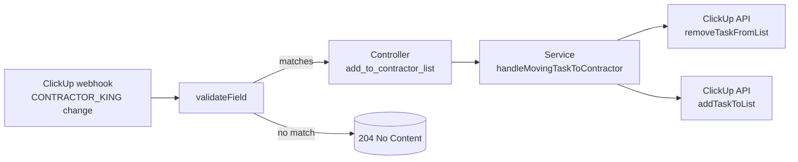
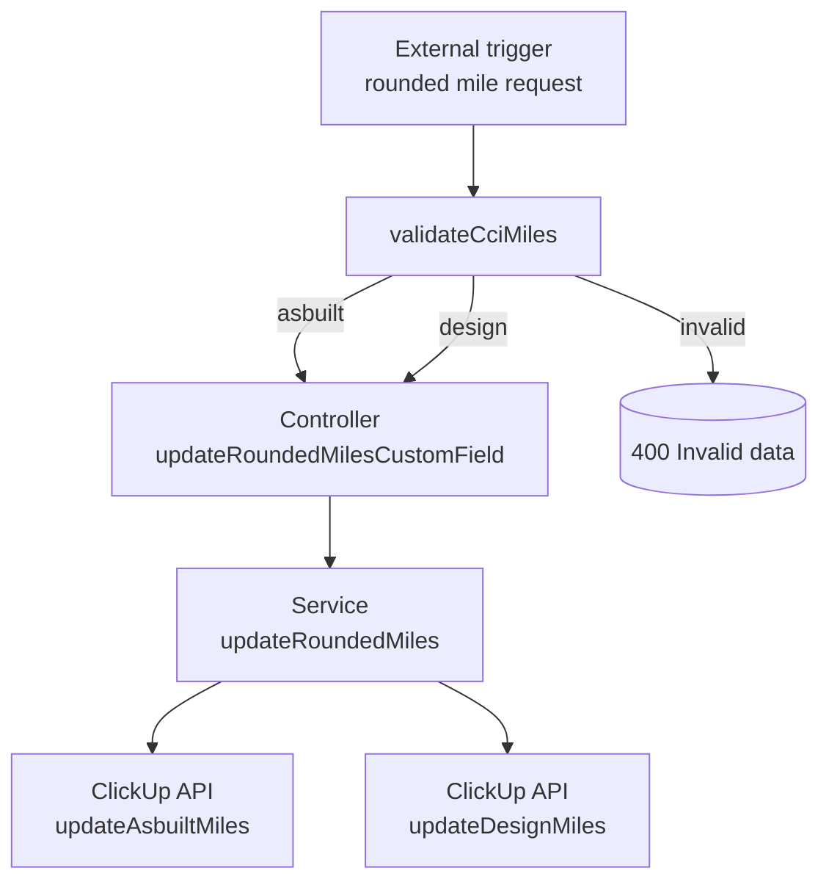
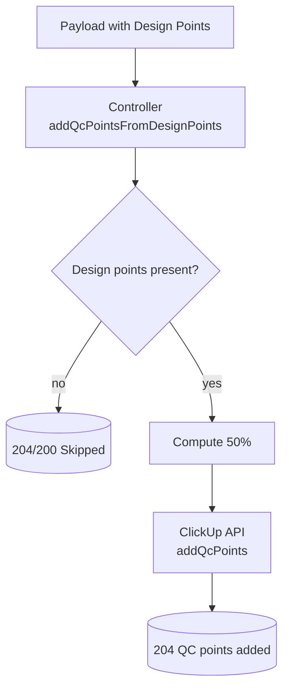
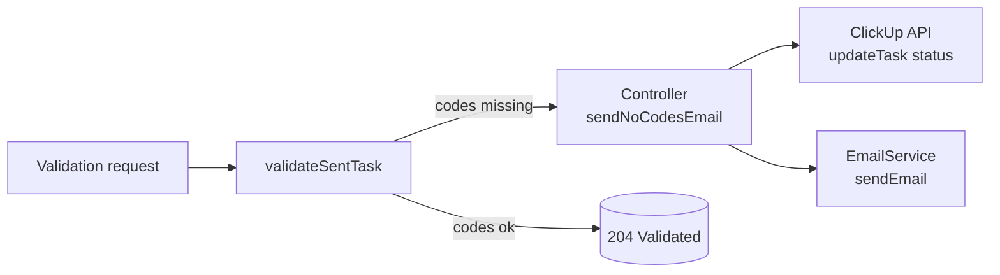
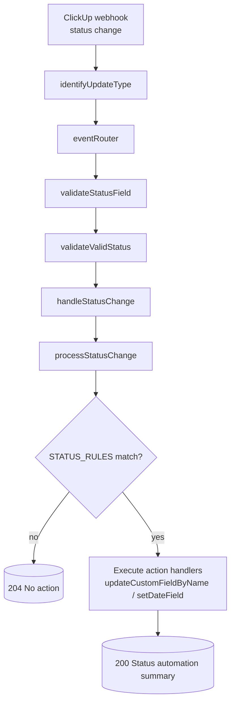
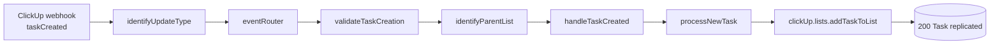
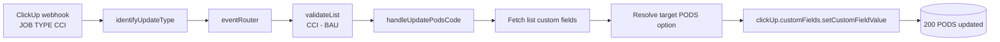
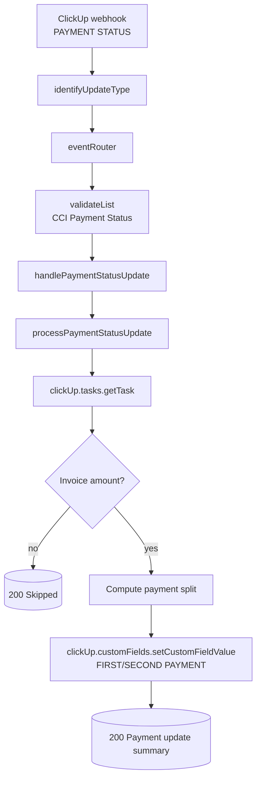

# OuterAPI

## Description

OuterAPI is an internal API consumed by the company Bl Technology (https://www.bl-technology.com/) developed by Jorge Diaz for automating tasks in ClickUp. This API receives and processes webhooks from ClickUp, enabling the integration and management of automated tasks specific to the company's projects.

## Technologies Used

- Node.js
- Express.js
- Axios
- ClickUp API
- Render

## Key Features

- Receiving and processing webhooks from ClickUp
- Middleware for data validation and event routing
- Integration with the ClickUp API for task management
- Automated handling of task status changes
- Automated due date updates based on estimated delivery dates
- Custom field updates and validations
- Email notifications for specific events
- Deployment on Render

## Architecture

OuterAPI follows a modular architecture with:

- **Event Router System**: Routes different webhook event types to specific handlers
- **Middleware Chains**: Customizable middleware chains for each event type
- **Update Type Identification**: Analyzes webhook payloads to determine specific update types
- **Service-Controller Pattern**: Separation of business logic and request handling

### Detailed Architecture

The application implements a sophisticated webhook handling system that efficiently processes ClickUp events:

#### Single Webhook Subscription with Granular Handling
- Rather than subscribing to multiple specific webhook events, the system subscribes only to the broader `taskUpdated` event
- Uses middleware to analyze and route different types of updates to specialized handlers

#### Dynamic Event Routing System
- The `identifyUpdateType` middleware examines webhook payloads to determine specific update types
- For status changes: sets `req.updateType = "taskStatusUpdated"`
- For custom fields: sets `req.updateType = "customField_FIELD_NAME"`

#### Request Flow
```
Webhook → identifyUpdateType → eventRouter → executeEventHandler → Specific Handler
```

#### Key Benefits
- **Scalability**: Easily add new event handlers without modifying routes
- **Maintainability**: Clean separation of concerns with dedicated handlers for each event type
- **Flexibility**: Custom middleware chains for each event type

For a complete technical explanation of the architecture, including code examples and detailed diagrams, refer to the documentation at `doc/ClickUp Webhook Event Handling Architecture.md`.

## Installation

To clone and run this application, you'll need [Git](https://git-scm.com) and [Node.js](https://nodejs.org/en/download/) (which includes [npm](http://npmjs.com)) installed on your computer.

```bash
# Clone the repository
git clone https://github.com/yourusername/outerapi.git

# Navigate to the project directory
cd outerapi

# Install dependencies
npm install

# Create a .env file and add the necessary environment variables
PORT=3000
API_KEY=your_clickup_api_key
SMTP_USER=your_smtp_user
SMTP_PASS=your_smtp_password
SMTP_HOST=your_smtp_host
SMTP_PORT=your_smtp_port
DEFAULT_USER=default_user_email

# Start the application
npm run dev
```

## Usage

### Endpoints

#### POST /webhook/king/add_to_contractor_list

- Description: Endpoint to add a task to a contractor's list based on the update of a custom field.
- Request Example:

```bash
{
  "task_id": "86b16vm66",
  "history_items": [
    {
      "user": {
        "username": "Jorge Diaz"
      },
      "before": "32beab3b-1daf-41cc-aa0f-d9d95eba1e17",
      "after": "35acd46d-4e7f-4050-bd47-5bbf2a6b9b03",
      "custom_field": {
        "name": "CONTRACTOR_KING"
      }
    }
  ]
}
```

#### POST /webhook/cci/round_miles

- Description: Endpoint to round miles in a custom field.
- Validates that the task contains the necessary custom fields.

#### POST /webhook/cci/add_qc_points

- Description: Endpoint to add QC points based on design points.

#### POST /webhook/cci/validate_sent_task

- Description: Validates sent tasks and sends email notifications if codes are missing.

#### POST /webhook/cci/webhook

- Description: Main webhook endpoint that handles various ClickUp events.
- Uses middleware to identify update types and route to appropriate handlers.
- Currently handles:
  - `taskStatusUpdated`: Processes status changes with validation
  - `customField_ESTIMATED_DELIVERY_DATE`: Updates task due dates to the next business day after the estimated delivery date

## Key Implemented Features

### Status Change Handling

- Detects specific status transitions (e.g., to "asbuilt ready for qc")
- Performs automated actions based on status changes
- Updates custom date fields when specific statuses are reached

### Estimated Delivery Date Automation

- Automatically updates a task's due date to the next business day after the estimated delivery date is changed
- Skips Sundays when calculating the next business day
- Only applies to tasks from specific lists (e.g., BAU list)

### Event Routing System

- Scalable architecture for handling multiple event types
- Each event type has its own middleware chain and handler
- Identifies specific update types within broader webhook events

## Contributing

For contributing to this project, please contact Jorge Diaz.

## License

This project is proprietary and owned by Bl Technology.

## Webhook Automations

### High-Level Automation Matrix

- **Contractor assignment sync** – `CONTRACTOR_KING` field changes move tasks between contractor-specific lists.
- **Rounded miles alignment** – Normalizes Design/Asbuilt mileage values and updates matching custom fields.
- **QC points seeding** – Copies 50% of Design Points into the QC Points custom field.
- **Missing codes escalation** – Sends email alerts and resets status when rate codes are absent or zero.
- **Status-driven updates** – Applies timestamp fields and list-specific actions for tracked status transitions.
- **Cross-list task replication** – Adds newly created tasks to companion billing/global lists based on their parent list.
- **Estimated delivery enforcement** – Moves due dates to the next business day for CCI BAU tasks.
- **Job type → PODS mapping** – Keeps the PODS (CCI) dropdown aligned with the JOB TYPE selection for CCI BAU.
- **Payment status settlement** – Sets FIRST/SECOND PAYMENT currency fields based on PAYMENT STATUS updates for list 901412536173.

### Detailed Automations

#### 1. Contractor Assignment Sync

- **Trigger**: `POST /webhook/king/add_to_contractor_list` invoked by ClickUp webhook payloads where the custom field `CONTRACTOR_KING` changes (`validateField`).
- **Scope**: Tasks coming from the master lists `901404064744` (Freedom) or `901404091622` (Keystone).
- **Actions**: Removes the task from the previous contractor list (if any) and adds it to the new contractor list by using the list mappings defined in `src/config/contractors.js`.
- **Outcome**: Task membership stays in sync with the contractor selected in ClickUp.



#### 2. Rounded Miles Alignment

- **Trigger**: `POST /webhook/cci/round_miles` with `task_id` and either `asbuilt_miles` or `design_miles` query params (`validateCciMiles`).
- **Scope**: CCI mileage updates regardless of list; values below 1 are coerced to 1 mile to avoid zeroed rounding.
- **Actions**: Updates `ASBUILT ROUNDED MILES`; when the design value changes it also mirrors the rounded value into the asbuilt field via `updateRoundedMiles`.
- **Outcome**: Design and Asbuilt rounded miles stay consistent inside ClickUp.



#### 3. QC Points Seeding

- **Trigger**: `POST /webhook/cci/add_qc_points` receiving a payload that includes the custom field `cb50c3de-e9b0-4e1f-b9a7-7dc792192704` (Design Points).
- **Scope**: Any task payload containing the Design Points field.
- **Actions**: Calculates 50% of the Design Points and posts the result into the `QC POINTS` custom field (`9ac8d58a-d1ae-46f6-8c29-6d49a63340de`).
- **Outcome**: Ensures QC Points default to half of the available Design Points.



#### 4. Missing Codes Escalation

- **Trigger**: `POST /webhook/cci/validate_sent_task` with task metadata (`validateSentTask`).
- **Scope**: Tasks whose numeric rate-code custom fields (names containing `(EA)`, `(FT)`, `(HR)`, `(MILE)`) are missing or equal to zero.
- **Actions**: Injects task details into the request, updates the task status to `ready to send`, and emails assignees plus the default user using the `getNoCodesEmail` template.
- **Outcome**: Surfaces configuration gaps before tasks move forward.



#### 5. Status-Driven Updates

- **Trigger**: `/webhook/cci/webhook` when `identifyUpdateType` detects `taskStatusUpdated`.
- **Scope**: Status values defined in `STATUS_RULES`; non-listed statuses return `204`.
- **Middlewares**: `validateStatusField` (extracts the status history item) and `validateValidStatus` (ensures the new status is actionable).
- **Actions**: `handleStatusChange` invokes `processStatusChange`, which executes the actions assigned to the target status:
  - `asbuilt ready for qc` → Set `first asbuilt qc submission date 1` with the history timestamp.
  - `design ready for qc` → Set `first design qc submission date 1`.
  - `redesign ready for qc` → Set `first redesign qc submission date 1`.
  - `redesign sent` → Set `redesign actual completion date`.
  - `asbuilt sent` → Set `preasbuilt actual completion date`.
  - `sent` → Set `actual completion date` and, for tasks in list `CCI - BAU (901404730264)`, populate `Date QCer` if empty.
  - `ready for qc` → Set `submitted to qc` and, for `CCI - BAU`, populate `Date Designer` if empty.
- **Outcome**: Timestamp audit fields stay aligned with lifecycle events while respecting list-specific guardrails.



#### 6. Cross-List Task Replication

- **Trigger**: `/webhook/cci/webhook` when `identifyUpdateType` emits `taskCreated`.
- **Scope**: Parent lists mapped in `identifyParentList`:
  - `CCI - HS (900200859937)` → add to billing `900201055245` and QC `901402069894`.
  - `CCI - BAU (901404730264)` → add to `Global - BAU (901409763969)`.
  - `TrueNet - BAU (901409412574)` → add to billing `901409442509` and `Global - BAU`.
  - `TechServ - BAU (901412194617)` → add to billing `901412194820` and `Global - BAU`.
- **Middlewares**: `validateTaskCreation` ensures the history item exists; `identifyParentList` determines the target lists and enriches the request.
- **Actions**: `handleTaskCreated` calls `processNewTask`, which in turn uses `clickUp.lists.addTaskToList` for every target list and reports the operation results.
- **Outcome**: Newly created tasks automatically appear in the required billing/global boards.



#### 7. Estimated Delivery Enforcement

- **Trigger**: `/webhook/cci/webhook` when `identifyUpdateType` labels the event as `customField_ESTIMATED_DELIVERY_DATE`.
- **Scope**: Tasks whose parent list is `CCI - BAU (901404730264)` (`validateList`).
- **Actions**: `handleEstimatedDeliveryDateUpdate` logs the change and updates the task `due_date` to the next business day (skipping Sundays) using the ClickUp REST API.
- **Outcome**: Due dates stay aligned with the estimated delivery date while respecting the working calendar.

```mermaid
flowchart TD
  A[ClickUp webhook
ESTIMATED DELIVERY DATE] --> B[identifyUpdateType]
  B --> C[eventRouter]
  C --> D[validateList
CCI - BAU]
  D --> E[handleEstimatedDeliveryDateUpdate]
  E --> F[Compute next business day]
  F --> G[ClickUp API
PUT /task/{id}]
  G --> H[(200 Due date updated)]
```

#### 8. Job Type → PODS Mapping

- **Trigger**: `/webhook/cci/webhook` when `customField_JOB_TYPE_CCI` is detected.
- **Scope**: Tasks in `CCI - BAU (901404730264)` via `validateList`.
- **Actions**: `handleUpdatePodsCode` fetches list custom fields, resolves the selected JOB TYPE option, and sets the `PODS (CCI)` dropdown to `781-045` when the new value equals `HIGH-SPLIT`, otherwise `781-043`.
- **Outcome**: PODS codes stay synchronized with the job type configuration.



#### 9. Payment Status Settlement

- **Trigger**: `/webhook/cci/webhook` when `customField_PAYMENT_STATUS` fires.
- **Scope**: Tasks in list `901412536173 (CCI - Payment Status)` enforced by `validateList`.
- **Actions**: `handlePaymentStatusUpdate` uses `processPaymentStatusUpdate` to fetch the task, read `INVOICE AMOUNT`, and:
  - On `PARTIAL PAYMENT` → set `FIRST PAYMENT` to 90% of the invoice.
  - On `PAID` → set `SECOND PAYMENT` to the remaining balance (default 10% unless the first payment differs).
  - Skips gracefully when the invoice amount is missing or the status is not tracked.
- **Outcome**: FIRST/SECOND PAYMENT fields reflect the expected payout split without manual calculations.


